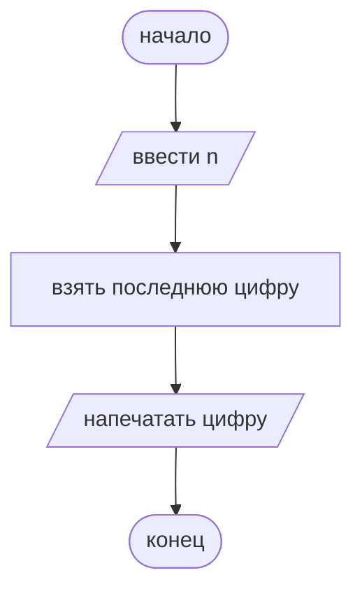
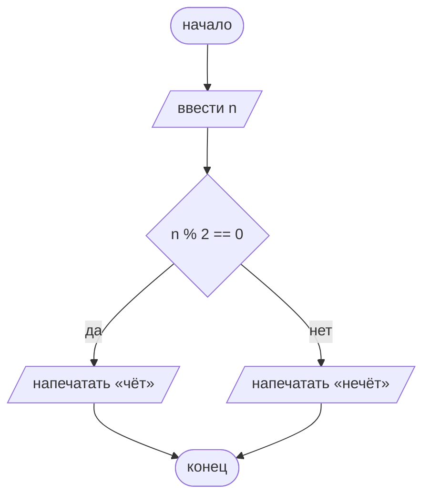
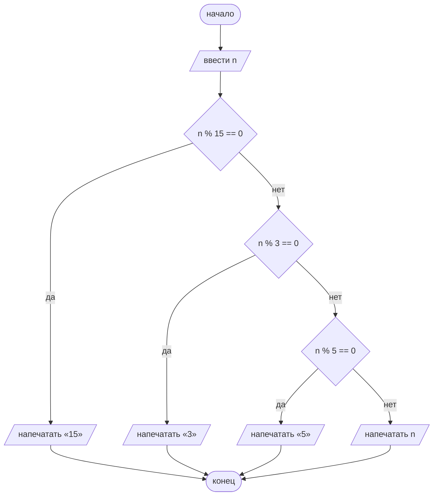
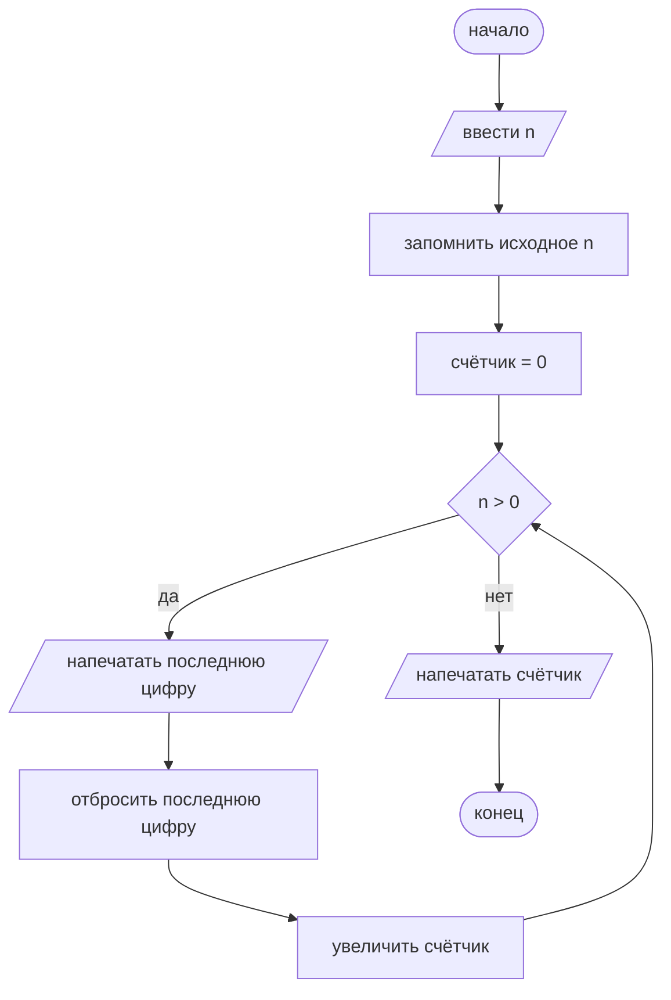
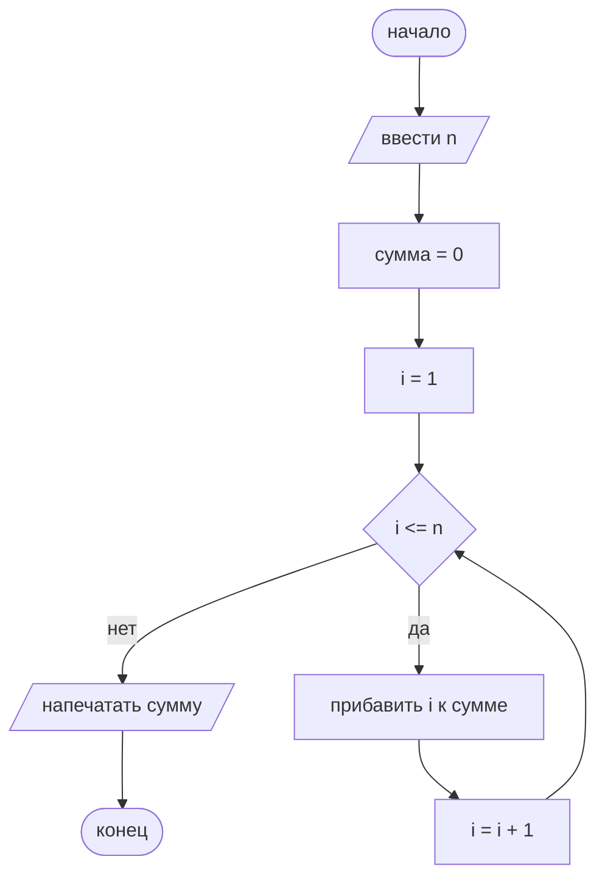
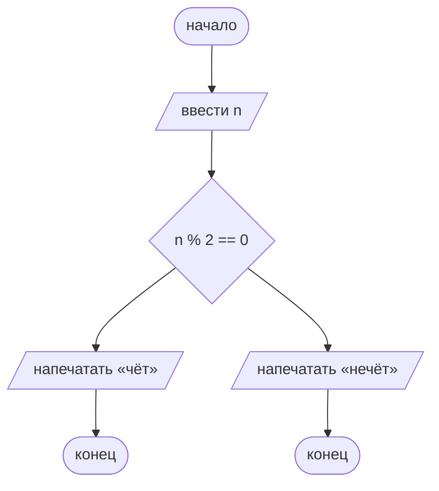
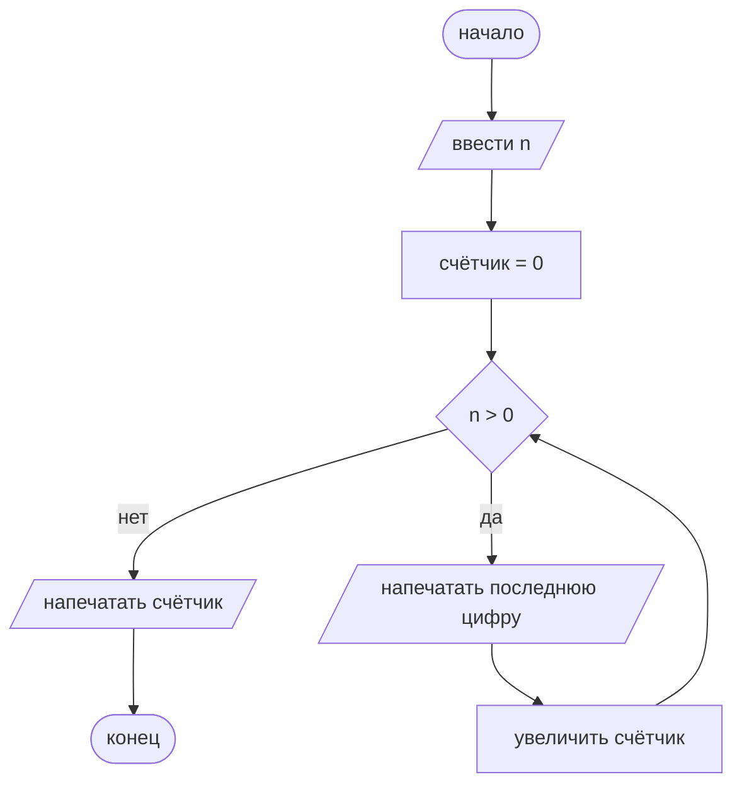
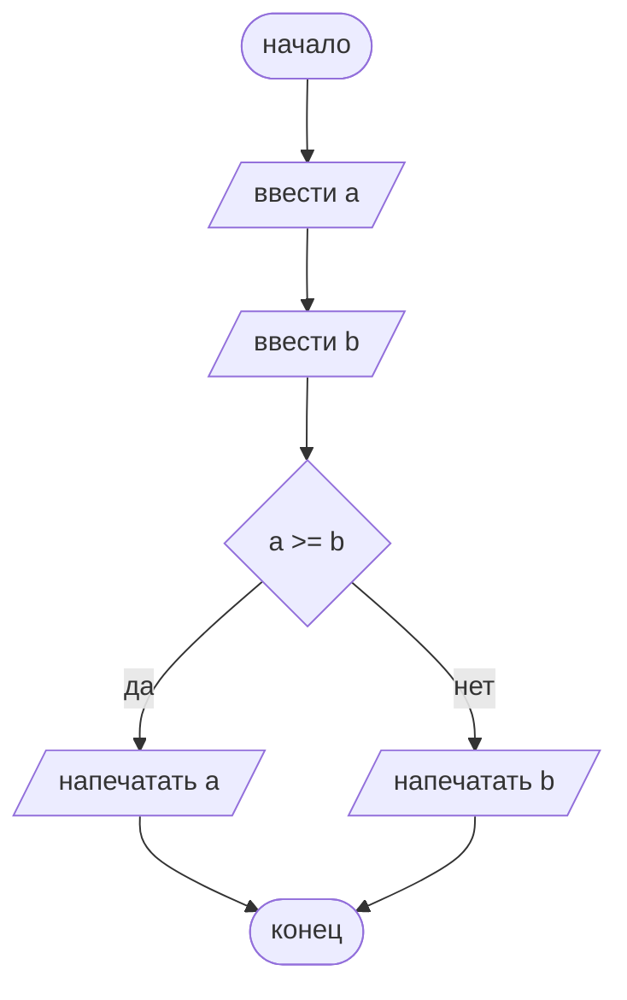
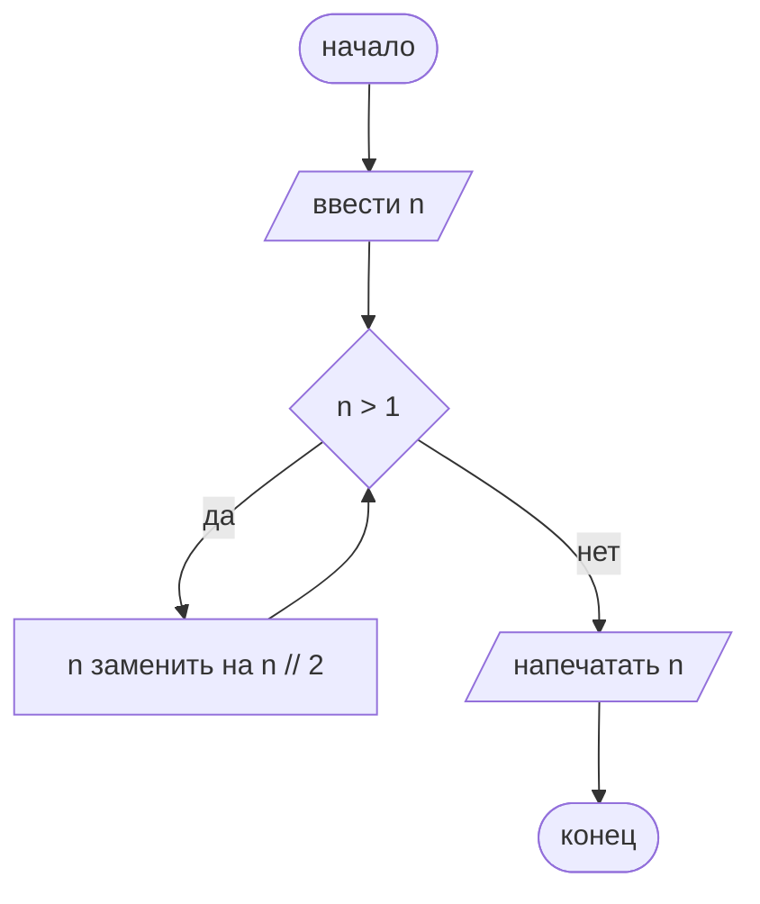

# Лекция 2. Блок-схемы

**Хронометраж пары (90 мин):** зачем ~5 мин → линейный путь ~15 мин → чёт/нечет ~20 мин → программа A и контраст отступов ~20 мин → `while` ~20 мин → `for` или анонс семинара 3 ~10 мин.

Если пара короче: с доски первым уходит разворот `for`, затем ужимаем программу A. Линейный сюжет, чёт/нечет, `while` и столбец Python не режем.

## Цели занятия

После лекции вы умеете:

1. Прочитать схему потока: какая фигура сейчас, куда идём по «да» и по «нет», чем кончится прогон конкретного числа.
2. Собрать схему из пяти рабочих фигур: начало/конец (овал), действие (прямоугольник), ввод/вывод (параллелограмм), условие (ромб), стрелки.
3. Нарисовать линейный путь, `if`/`else`, цепочку `elif` и один `while` (цикл = ромб + стрелка назад).
4. Сопоставить отступ в Python с веткой «да» по **правому столбцу кода**, не по геометрии схемы. Отличить цепочку `elif` (все `print` на одном уровне) от вложенного `if` (лишний отступ при почти той же картинке).
5. Проверить схему тремя правилами, из-за которых она врёт: одно начало и один конец; у каждой стрелки из ромба есть «да» или «нет»; ветки сливаются, в цикле условие меняется.

---

## 0. Зачем это в курсе

Алгоритм один, запись разная.

**Блок-схема** — чертёж потока управления: что за чем выполняется, где выбираем, где возвращаемся. 
Она не привязана к языку. 
Ошибка в ромбе видна до запуска: не туда пошла стрелка «да» — это видно карандашом, без запуска.

---

## 1. Линейный путь: фигуры и правила

Направление на листе обычно сверху вниз и слева направо. Это привычка чертежа.

### Пять рабочих фигур

| Фигура | Вид | Что внутри |
|---|---|---|
| Начало / конец | овал | «начало», «конец» |
| Действие | прямоугольник | шаг по-русски («отбросить последнюю цифру») |
| Ввод / вывод | параллелограмм | что читаем или печатаем |
| Условие | ромб | условие **как в коде** (`n % 2 == 0`) |
| Стрелка | линия со стрелкой | только в одну сторону |

В текущем курсе, цикл отдельной фигурой не вводим: это ромб и стрелка назад. 
Кружок-коннектор «на другую страницу» не вводим. 
Если схема не лезет на лист, режем задачу, а не ставим кружок.

Общие правила.
В фигурах короткий русский. В ромбе условие как в Python. Отступ смотрим **справа**, не по сдвигу веток на чертеже.

### Три правила
Эти три правила — это не просто "оформление красивой схемы". Они нужны, чтобы блок-схема однозначно описывала алгоритм. 
Если их нарушить, человек, читающий схему, может выполнить алгоритм неправильно.

1. **Одно начало и один конец.**
2. **У каждой стрелки из ромба подписано «да» или «нет».** Сторона по удобству листа; на доске удобнее «да» вправо или вниз. На одной схеме без подписи смысл не меняем.
3. **Ветки после выбора сливаются.** В цикле условие меняется, иначе стрелка назад не остановится.

### Пример: последняя цифра

Ввести целое $n$, взять последнюю цифру, напечатать её.



Тот же код на Python:

```python
n = int(input())
d = n % 10
print(d)
```

Ввод и вывод в **параллелограмме**, не в прямоугольнике. Прямоугольник здесь один: «взять последнюю цифру».

*Частая ошибка.* `input` и `print` рисуют процессом. Тогда на схеме нельзя отличить «посчитать» от «спросить у человека». 
Два овала «начало» или конец без овала тоже ломают правило 1. Стрелка без острия не показывает направление потока.

---

## 2. Ветвление и отступ

Сюжет: чёт или нечет, условие `n % 2 == 0`.

Классика: из ромба ветки **в стороны**, слияние **снизу**. Геометрию под отступы Python не подстраиваем: схема не обязана выглядеть как абзац кода.



Слияние здесь само: обе ветки входят в один овал «конец». Отдельный пустой прямоугольник «точка слияния» на доске не нужен, пока после выбора больше ничего не делаем.

Тот же код на Python:

```python
n = int(input())
if n % 2 == 0:
    print("чёт")
else:
    print("нечёт")
```

После ромба, четыре пробела у `print("чёт")` это ветка «да», пока потоки не слились. После слияния отступ пропадает: `конец` в схеме, а в Python следующая строка снова у левого края (здесь программы просто заканчиваются).

*Частая ошибка.* Не подписали «да»/«нет»: при прогоне непонятно, куда идти. Обе стрелки вниз без слияния: дальше кажется, будто выполняем обе ветки сразу. В прямоугольнике сразу длинный Python вместо короткого русского: схема перестаёт быть языконезависимой.

---

## 3. Цепочка `elif` и контраст вложенного `if`

Ввести целое $n$. Напечатать `"15"`, если $n$ делится на 15; иначе `"3"`, если делится на 3; иначе `"5"`, если делится на 5; иначе само число.

Порядок веток важен: проверка на 15 раньше, чем на 3 и на 5. Иначе для $n = 15$ напечатается `"3"`.

На схеме это **цепочка ромбов**. В Python все `print` на **одном** уровне отступа.



```python
n = int(input())
if n % 15 == 0:
    print("15")
elif n % 3 == 0:
    print("3")
elif n % 5 == 0:
    print("5")
else:
    print(n)
```

### Пример выполнения на схеме

**$n = 15$.** Ромб `n % 15 == 0`: да. Печатаем `"15"`. К ромбам «3» и «5» не идём. Слияние → конец.

**$n = 3$.** Первый ромб: нет. Второй `n % 3 == 0`: да. Печатаем `"3"`. Третий ромб не смотрим.

### Вложенный `if`

Тот же смысл можно записать вложенными `if` внутри `else`. **Схема почти та же цепочка ромбов.** Разница видна справа: лишний отступ.

```python
n = int(input())
if n % 15 == 0:
    print("15")
else:
    if n % 3 == 0:
        print("3")
    else:
        if n % 5 == 0:
            print("5")
        else:
            print(n)
```

`elif` держит все печати на одном уровне. Вложенный `if` каждый раз добавляет абзац. Чертёж классической схемы этого не показывает: отступ в коде.

---

## 4. Цикл `while`

Отдельной фигуры «цикл» нет: ромб условия и стрелка **назад**.

Натуральное $n \ge 1$ (предусловие словами, в коде не проверяем). Пока $n > 0$: напечатать последнюю цифру, отбросить её, увеличить счётчик. Исходное $n$ сохраняем, если в конце сверяем счётчик с `len(str(...))`.



```python
n = int(input())
saved = n
count = 0
while n > 0:
    print(n % 10)
    n //= 10
    count += 1
print(count)
print(len(str(saved)))
```

Тело `while` с отступом: три строки между ромбом «да» и возвратом к ромбу. Строки `print(count)` и сверка с `len` уже после слияния «нет».

### Пример выполнения на схеме

$n = 207$ Исходное значение запомнили, счётчик $0$.

| Шаг | $n$ до ромба | $n > 0$? | Печать цифры | $n$ после отброса | счётчик |
|---:|---:|---|---:|---:|---:|
| 1 | 207 | да | 7 | 20 | 1 |
| 2 | 20 | да | 0 | 2 | 2 |
| 3 | 2 | да | 2 | 0 | 3 |
| 4 | 0 | нет | | | печатаем 3 |

`len(str(207))` тоже $3$. Ноль в середине (цифра десятка) это цифра, её печатаем; ноль как *значение* $n$ цикл останавливает.

Правило 3 на этом чертеже: шаг «отбросить последнюю цифру» меняет условие. Если его забыть, $n$ навсегда $207$, стрелка назад вечная.

---

## 5. Цикл `for`

`for i in range(...)` в Python одна строка с отступом тела. На схеме это **четыре шага**, не новая фигура.

Натуральное $n \ge 1$. Сумма чисел от $1$ до $n$, цикл `for` и `range(1, n + 1)`. Правый конец `range` не входит, поэтому `n + 1`.

Разворот: $i = 1$ → ромб $i \le n$ → прибавить $i$ к сумме → $i = i + 1$ → назад. Тело с отступом: то, что между ромбом «да» и увеличением счётчика.



```python
n = int(input())
s = 0
for i in range(1, n + 1):
    s += i
print(s)
```

---

## Справочник

### Пять фигур

| Фигура | Вид | Что писать внутри |
|---|---|---|
| Начало / конец | овал | «начало», «конец» |
| Действие | прямоугольник | шаг по-русски |
| Ввод / вывод | параллелограмм | что читаем или печатаем |
| Условие | ромб | условие как в коде |
| Стрелка | линия со стрелкой | одно направление; из ромба с «да» или «нет» |

### Три правила

1. Одно начало и один конец.
2. У каждой стрелки из ромба есть «да» или «нет».
3. Ветки сливаются. В цикле условие меняется.

Классика листа: ветки ромба в стороны, слияние снизу.

### Шпаргалка `for`

Разворот: начальное $i$ → ромб «ещё нужно?» → тело (отступ в коде) → увеличить $i$ → назад.

Сжатая подпись ромба, когда разворот уже понятен: «$i$ от 1 до $n$» или «$i$ от 0 до $n-1$». Отдельной фигуры цикла нет.

---

## Упражнения

Сначала попробуйте сами, эталоны в следующем разделе.

**1. Найди ошибку.** Схема `if`/`else` без подписей «да»/«нет» и без слияния. Что сломается при запуске? Как исправить, не меняя смысл.



**2. Найди ошибку.** Цикл по цифрам, в теле нет шага «отбросить последнюю цифру». Почему не остановится? Как исправить **без** `break`.



**3. Схема → Python.** Перепишите чертёж из **2** (чёт/нечет) в код. Условие в ромбе оставьте тем же.

**4. Схема → Python.** Перепишите чертёж из **1** (последняя цифра) в код.

**5. Python → фигуры.** Нарисуйте схему. В фигурах русский, в ромбе условие как в коде.

```python
a = int(input())
b = int(input())
if a >= b:
    print(a)
else:
    print(b)
```

**6. Python → фигуры.** Нарисуйте схему со стрелкой назад.

```python
n = int(input())
while n > 1:
    n = n // 2
print(n)
```

**7. Прогон.** По схеме программы A из **3**: путь по фигурам и что напечатается для $n = 30$ и для $n = 7$.

### Ответы к упражнениям

**1.** Из ромба две неподписанные стрелки: при прогоне неясно, какая ветка «да». 
Два овала «конец» ломают правило «один конец»; слияния нет, кажется, будто можно выйти дважды. 
Исправление: подписи «да»/«нет», обе ветки в одну точку, затем один конец. Как в **2**.

**2.** Условие $n > 0$ не меняется: если вошли с $n = 207$, так и останемся. Стрелка назад вечная. 
Исправление: в ветке «да» после печати цифры шаг «отбросить последнюю цифру» (`n //= 10`), затем увеличить счётчик, затем снова ромб. Не `break` и не второй конец.

**3.**

```python
n = int(input())
if n % 2 == 0:
    print("чёт")
else:
    print("нечёт")
```

**4.**

```python
n = int(input())
d = n % 10
print(d)
```

**5.** Овал → два параллелограмма (ввести $a$, ввести $b$) → ромб `a >= b` → «да»: напечатать $a$; «нет»: напечатать $b$ → слияние → конец.



**6.** Овал → ввести $n$ → ромб `n > 1` → «да»: $n$ заменить на $n // 2$, назад к ромбу → «нет»: напечатать $n$ → конец. В теле условие меняется.



**7.** $n = 30$: `30 % 15 == 0` да → печать `"15"`. До ромбов 3 и 5 не доходим. $n = 7$: 15 нет, 3 нет, 5 нет → печать `7`.

---

## Контрольные вопросы

Короткие вопросы на понимание. Эталоны в следующем разделе; сначала ответьте сами.

1. Зачем на схеме параллелограмм, если есть прямоугольник? Приведите пример шага, который в прямоугольник класть нельзя.
2. Что должно быть подписано на стрелках из ромба? Почему «и так видно» ломает прогон.
3. Чем на схеме цепочка `elif` отличается от вложенного `if`? Где разница видна в Python, если чертежи похожи.
4. Как на этой лекции рисуют цикл без отдельной фигуры «цикл»? Что должно меняться в теле `while`.
5. Почему у схемы одно начало и один конец?
6. Схема не привязана к языку. Что это значит для года на Python и следующего года на C?

### Ответы для самопроверки

1. Прямоугольник это действие (посчитать, запомнить, увеличить). Параллелограмм это обмен с внешним миром: ввод и вывод. `input` и `print` в прямоугольник класть нельзя: на чертеже они сольются с присваиванием.
2. «Да» и «нет». Без подписи при прогоне числа непонятно, в какую ветку идти; «очевидная» сторона на следующем чертеже может оказаться другой.
3. На классической схеме это одна и та же цепочка ромбов. В Python `elif` держит печати на одном уровне отступа, вложенный `if` добавляет абзац.
4. Ромб условия и стрелка назад. В теле должно меняться то, что стоит в ромбе. Иначе цикл не остановится.
5. Иначе поток нельзя прогнать однозначно: два конца это уже два разных выхода, на этой паре их не чертим.
6. Алгоритм один, запись разная. Тот же чертёж в этом году читается рядом с отступами Python, в следующем сядет на скобки C без новой нотации фигур.
